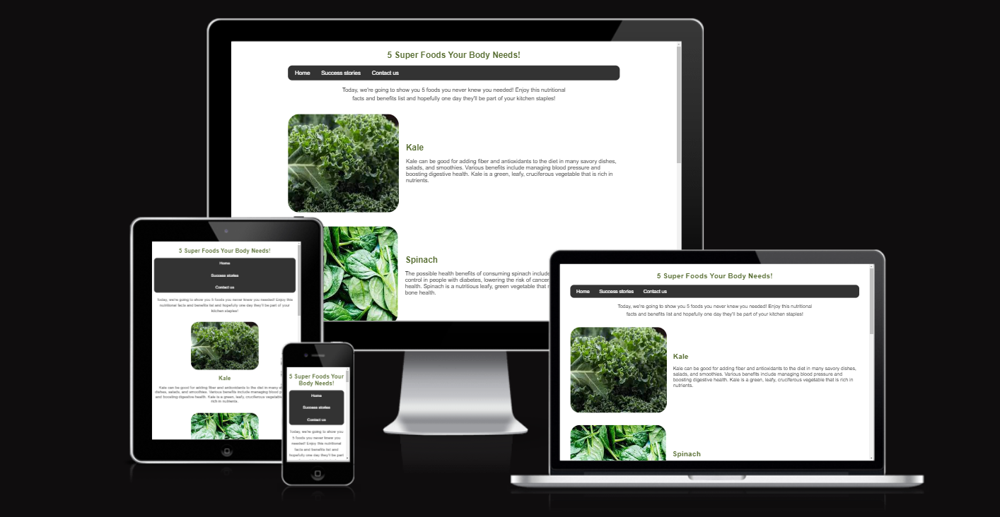
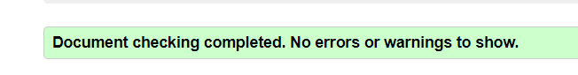

# 5 Super foods your body needs

5 super foods your body needs is a website where you can find benefits of eating certain foods and changes they can make to your body. It also shows the user other members of the site who are sharing their stories about their change in diet. The site is simple and easy to navigate making it accessible for all users.

[View 5 super foods your body needs live project here](https://holliemorrison.github.io/superfoods/)

## Table of contents :

### [User Experience (UX)](#user-experience-ux-1)
* [User Stories](#user-stories)
### [Features](#features)
* [Existing Features](#existing-features)
### [Features Left To Implement](#features-left-to-implement-1)
### [Design](#design-1)
### [Technologies Used](#technologies-used-1)
### [frameworks](#frameworks-libraries-programs-used-1)
### [Testing](#testing-1)
* [Validation Results](#validation-results)
* [Manual Testing](#manual-testing)
* [Lighthouse Report](#lighthouse-report)
### [Deployment and local development](#deployment-and-local-development-1)
* [GitHub Pages](#github-pages)
* [Forking the GitHub Repository](#forking-the-github-repository)
* [Local Clone](#local-clone)
### [Credits](#credits-1)
### [Acknowledgements](#acknowledgements-1)
---

## User Experience (UX)

This website was made to attract users who appreciate a simple way of getting important information about vegetables that would make significant changes to health and lifestyle habits.

There is clear navigation to be used on all pages and a form where users can give us feedback or tell us about their health journey.

People can contact 5 super foods your body needs to discuss any dietary questions or concerns.

### User Stories

*First-time visitor goals
  * Understand the main purpose of the site and learn about foods you should make a part of their diet.
  * To navigate the site easily.
  * To go to contact page and send a questions about healthy lifestyles.
  * Look at gallery of site members.
- - -

## Features

* Home page with information about super foods 
* Success stories page full of pictures of members and how their lives have changed since joining.
* In future, there could be a form for members to join the sites members list.

[Index.html](./assets/readme/index.html_pageshot.png)
[Stories.html](./assets/readme/stories.html_pageshot.png)
[Contact.html](./assets/readme/contact.html_pageshot.png)

## Design

* Simple design with basic colors and fonts for accessibility and simplicity on the eyes.
* Curved edges on home page to relax the eyes and not appear so harsh.

## Technologies Used

* [HTML5]((https://en.wikipedia.org/wiki/HTML5))
* [CSS3]((https://en.wikipedia.org/wiki/CSS))

## Frameworks, Libraries & Programs Used

* [Github](https://github.com/)
    * Deployment of the website and storing the files online.
* [Am I Responsive](https://ui.dev/amiresponsive?url=https://holliemorrison.github.io/superfoods/)
    * Mockup picture for the README file.
* [Visual Studio Code](https://code.visualstudio.com/)

---

## Testing

The W3C Markup Validator and W3C CSS Validator services were used to validate every page of the project to ensure there were no errors.

 * [W3C Markup Validtor](https://validator.w3.org/)
 * [W3C CSS Validator](https://jigsaw.w3.org/css-validator/)

### Validation results

index.html

stories.html

contact.html

thanks.html

contact.css

home.css

### Manual Testing

* The website was tested on Google Chrome, Microsoft Edge, and Opera browsers.
* The website was viewed on a desktop computer, laptop, and Samsung Galaxy A52 mobile phone.
* A large amount of testing was done to ensure links between pages are working correctly on all pages.
* Family and friends were asked to review the website for a better understanding of the user experience.
* Dev Tools was used to test how the site looks on various screen sizes.

### Lighthouse Report

#### Mobile analysis

Home Page

Gallery

Sign Up

Application Received

#### Desktop analysis

Home Page

Gallery

Sign Up

Application Received

---

## Deployment and local development

### GitHub Pages

GitHub Pages used to deploy live version of the website.
1. Log in to GitHub and locate [GitHub Repository 5 super foods your body needs](https://holliemorrison.github.io/superfoods/)
2. At the top of the Repository(not the main navigation) locate "Settings" button on the menu.
3. Scroll down the Settings page until you locate "GitHub Pages".
4. Under "Source", click the dropdown menu "None" and select "Main" and click "Save".
5. The page will automatically refresh.
6. Scroll back to locate the now-published site [link](https://holliemorrison.github.io/superfoods/index.html) in the "GitHub Pages" section.

### Forking the GitHub Repository

By forking the repository, we make a copy of the original repository on our GitHub account to view and change without affecting the original repository by using these steps:

1. Log in to GitHub and locate [GitHub Repository 5 super foods your body needs](https://holliemorrison.github.io/superfoods/)
2. At the top of the Repository(under the main navigation) locate "Fork" button.
3. Now you should have a copy of the original repository in your GitHub account.

### Local Clone

1. Log in to GitHub and locate [GitHub Repository 5 super foods your body needs](https://holliemorrison.github.io/superfoods/)
2. Under the repository name click "Clone or download"
3. Click on the code button, select clone with HTTPS, SSH or GitHub CLI and copy the link shown.
4. Open Git Bash
5. Change the current working directory to the location where you want the cloned directory to be made.
6. Type `git clone` and then paste The URL copied in the step 3.
7. Press Enter and your local clone will be created.

---
